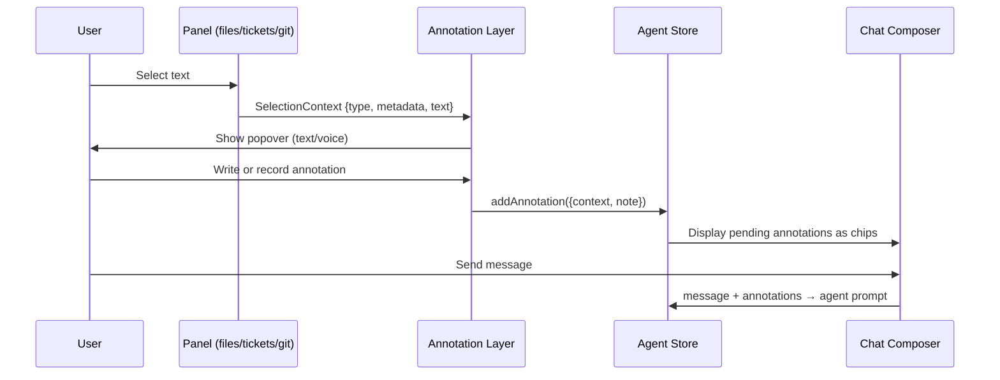
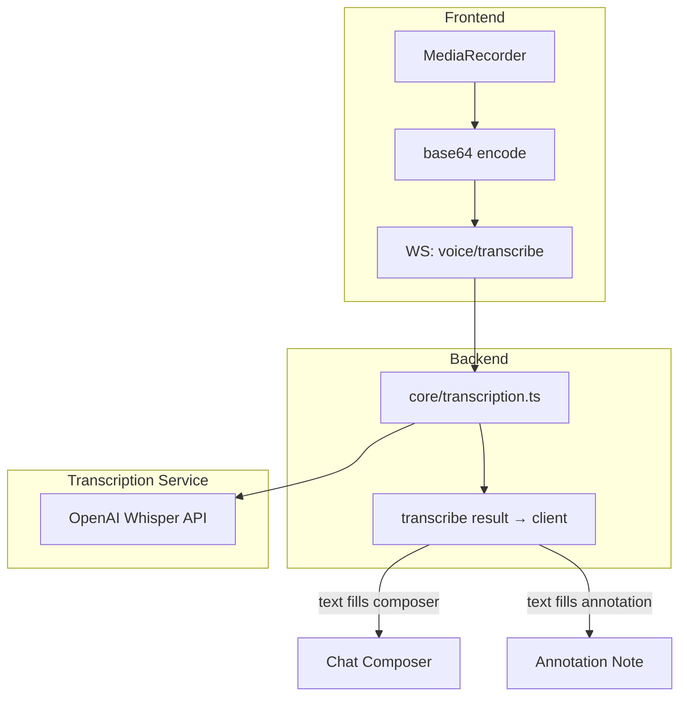
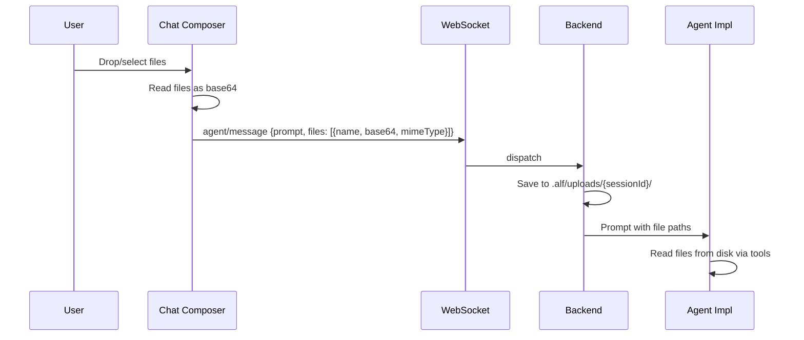
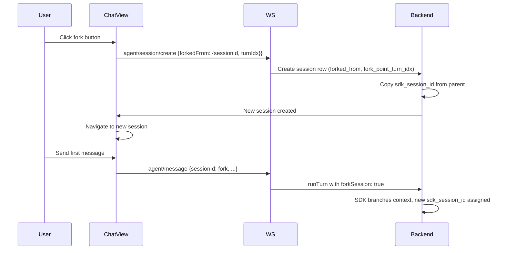
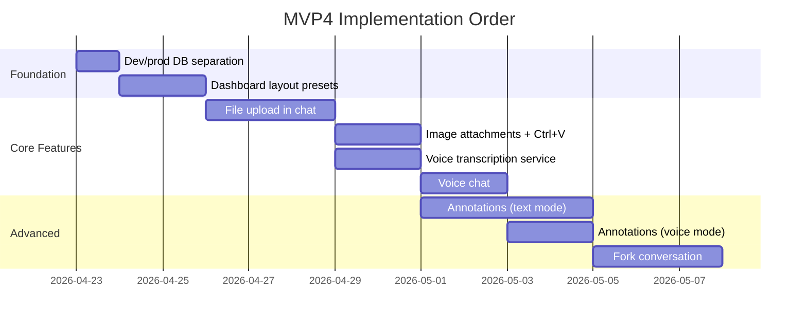

Research ticket for MVP4. Covers architecture, open questions, and implementation strategy for bringing alf to SWE parity with nanoclaw.

## MVP4 Feature Inventory

| # | Feature | Complexity | Dependencies |
|---|---------|-----------|-------------|
| 1 | Annotations (text selection → chat) | L | Agent panel, all panels |
| 2 | Voice chat + transcription | M | Transcription API, annotations |
| 3 | File upload in chat | M | Agent module |
| 4 | Image attachments (+ Ctrl+V) | M | File upload |
| 5 | Fork conversation | M | Agent core, DB |
| 6 | Dashboard layout presets | S | Dashboard store |
| 7 | Dev/prod DB separation | S | Infra |

---

## 1. Annotations

### What it is
User selects text/element in **any panel**, then writes or speaks a note about it. The selection context + annotation get injected into the active chat session as structured context.

### How nanoclaw-dev does it
- `useSelectionFollowup` hook: listens `mouseup`, reads `window.getSelection()`, extracts `data-fileref` + `data-line` DOM attributes for precise file:line references.
- `SelectionPopover` component: floating popover at selection rect, 3 modes (auto-record, manual, text-only).
- Annotations accumulate as `pendingAnnotations[]` in conversation state. On send, they're formatted as blockquotes prepended to the message.

### Architecture question: per-panel contracts

The key design challenge: each panel has **different selection context**. A file panel gives `{filePath, startLine, endLine, selectedText}`. A tickets panel gives `{ticketId, selectedText}`. A git panel gives `{commitHash, filePath, hunkRange, selectedText}`.



#### Approach A: Panel-specific selection providers

Each panel registers a `getSelectionContext(): SelectionContext | null` callback. The annotation layer calls whichever panel currently has focus.

```typescript
// Contract
interface SelectionContext {
  panelType: PanelType;
  text: string;
  metadata: Record<string, unknown>; // panel-specific
}

// File panel metadata: { filePath, startLine, endLine }
// Ticket panel metadata: { ticketId, ticketTitle }
// Git panel metadata: { commitHash, filePath, hunkRange }
```

**Pros**: Clean separation. Panels own their context.
**Cons**: Each panel needs selection-awareness code. More surface area.

#### Approach B: DOM-attribute convention

Panels just add `data-alf-ctx="..."` attributes to their DOM. A global selection handler reads these from the selection range's ancestor elements. This is what nanoclaw does with `data-fileref` and `data-line`.

**Pros**: Panels barely change. One global handler.
**Cons**: Context is limited to what you can encode in DOM attributes. Harder to debug.

#### Approach C: Hybrid

Panels add DOM attributes for basic context. A global handler reads those. But panels can *also* register an enrichment callback for richer context when needed.

### Decisions

1. **Approach: C (hybrid), DOM-first.** Use `data-alf-ctx-*` DOM attributes as far as possible. Walk up from selection node, collecting all `data-alf-ctx-*` attributes into annotation context. Panels enrich via callbacks only when DOM attributes aren't enough.

2. **State: separate `annotationStore`.** Keeps annotations alive even if the agent panel unmounts (important for mobile where switching panels may unmount the agent view). Annotations are cross-panel by nature — they originate in file/ticket/git panels but get consumed by the agent panel's composer.

3. **Annotation modes: both text and voice from the start.** Top bar (where lock icon lives), center area: two toggle buttons — Voice and Text. Mutually exclusive (only one active at a time), both can be off. When off, text selection doesn't trigger annotation flow. Voice uses the same `voice/transcribe` endpoint as voice chat — transcription result fills into the annotation text.

4. **Ephemeral — cleared on send.** Annotations accumulate as pending items, displayed as chips in the composer. On send, each annotation is reduced to formatted text (selection context as blockquote + annotation note) and prepended to the message. Nothing special about it — just text. After send, pending annotations are cleared.

5. **Cross-panel: yes, inherently.** Annotations originate in any panel (files, tickets, git) but all end up in the agent panel's current session message. The `annotationStore` collects them regardless of source panel. Each annotation carries its `SelectionContext` with panel-specific metadata from DOM attributes.

---

## 2. Voice Chat + Transcription

### How nanoclaw-dev does it

**Recording**: Browser `MediaRecorder` API. MIME priority: `audio/mp4` → `audio/webm;codecs=opus` → `audio/webm`. Chunks every 250ms, concatenated on stop, converted to base64.

**Transcription**: OpenAI Whisper (`whisper-1`) via REST. `multipart/form-data` POST to `https://api.openai.com/v1/audio/transcriptions`. Returns `{text, segments, language, duration}`.

**One flow only: `voice/transcribe`.** No `voice/message` needed. Voice is always converted to text before anything else happens. For voice chat: user records → stop → transcribe → text appears in composer → user can edit/add more → send as normal text message. The agent module never sees voice. For voice annotations: same flow, transcript fills the annotation note.

### Architecture for alf



### Decisions

1. **Transcription placement: `core/transcription.ts`** — lightweight core service with a single `voice/transcribe` WS endpoint. Not a full module (no panel, no separate module dir). Just a core service + one handler. Whisper call is simple enough to keep it minimal.

2. **Whisper.** Proven, works well in nanoclaw. Use OpenAI Whisper (`whisper-1`) via REST.

3. **API key: `OPENAI_API_KEY` env var.** Already set up in dev infra. Code should log a warning/error if not detected, but no special config story needed.

4. **No audio storage.** Audio stays in memory during transcription only, discarded after.

5. **Text-in, text-out.** Voice is just an input method — always transcribed to text immediately. No TTS on the response side.

---

## 3. File Upload in Chat

### What it is
User attaches files to a chat message. Any file type — no restrictions, no filters. Whatever the user picks gets uploaded.

### Architecture



### Decisions

1. **All file types, no size limit.** No filtering. The user picks files, they get uploaded. No restrictions.

2. **Always disk, never inline.** Files are saved to `.alf/uploads/` in the repo (gitignored). Agent receives file paths in the prompt and reads them with its tools. This works for all file types including binary.

3. **Frontend UX: drag-and-drop on composer + file icon button.** Composer bar inspired by the 9 o'clock design — two icons: voice (microphone) and files (general file icon, not image-specific). Drag-and-drop onto the composer area also works. All attached files show as preview chips: images show a thumbnail preview, other files show truncated filename + extension badge.

4. **`.alf/` directory convention.** Backend ensures `.alf/` exists in the repo with the right structure:
   - `.alf/tickets/` — ticket markdown files (existing)
   - `.alf/uploads/` — uploaded files (gitignored)
   - `.alf/.gitignore` — ignores `uploads/`
   This setup should be baked into the system prompt and also enforced by backend code that initializes the `.alf/` dir when a repo is first used.

---

## 4. Image Attachments (+ Ctrl+V)

### How nanoclaw-dev does it
- **Paste**: `onPaste` on textarea, filter `clipboardData.files` for `image/*`, convert to base64.
- **File input**: hidden `<input type="file" accept="image/*" multiple>`, max 4 images.
- **Sending**: images in WS payload as `{base64, mimeType}[]`. Server saves to `data/images/{uuid}.ext`.
- **Agent**: paths passed as `[Image N: /path]` in prompt.
- **Display**: when agent references `[Image: /path]`, client fetches via `fetch_image` WS type, caches in OPFS.

### Decisions

Images are **not treated specially** — they go through the same file upload pipeline as everything else:

1. **Same storage as files.** Images upload to `.alf/uploads/` just like any other file. Agent gets the file path and can read/view it with its tools.

2. **Ctrl+V paste** on the composer textarea intercepts `image/*` from clipboard and adds it as an attached file (same as drag-and-drop).

3. **Preview in composer**: images show a thumbnail preview chip, other files show truncated filename + extension badge. But the upload mechanics are identical.

4. **No `[Image: /path]` rendering in agent responses.** Instead, use the existing file panel to browse images. The file panel should support rendering images (not just text files). To handle gitignored images/data dirs:
   - File panel gets an "exceptions" mechanism: user can opt-in to showing specific gitignored directories (e.g., `data/`, `.alf/uploads/`).
   - Optional: cap large directories (100+ files) — don't send full listing by default, let user expand on demand.

---

## 5. Fork Conversation

Simple fork — nanoclaw parity. Forked session is its own first-class session in the sessions list. No tree view, no sub-sessions, no graph UI for now (see future ticket T-024).

### How nanoclaw-dev does it
1. Client sends `fork_conversation` with `sourceConversationId`.
2. Server creates new conversation, copies `session.id` file (SDK session context).
3. Next `runAgent()` call passes `forkSession: true` to SDK — branches the context window.
4. Client navigates to new conversation.

### Decisions

1. **Reuse `agent/session/create`** with optional `forkedFrom: { sessionId, turnIdx }`. No separate fork endpoint. Same flow as creating a new session, just with fork metadata.

2. **SDK session handling on first turn of fork:**
   - Fork copies `sdk_session_id` from parent.
   - First `runTurn()` on the fork passes `forkSession: true` to the SDK — this branches the SDK context.
   - After that first turn, the fork gets its **own** `sdk_session_id`. Subsequent turns use the new ID normally.

3. **Fork UI: button in ChatView header**, next to the impl/model dropdown.

4. **Forked session = regular session.** Shows up in the sessions list like any other session. Has a `forked_from` column for provenance but otherwise behaves identically to a new session.

### DB changes needed

```sql
-- Sessions table additions:
ALTER TABLE sessions ADD COLUMN forked_from TEXT REFERENCES sessions(id);
ALTER TABLE sessions ADD COLUMN fork_point_turn_idx INTEGER;
```

### Flow



---

## 6. Dashboard Layout Presets

### What it is
Save named layout configurations and switch between them quickly. E.g., "Agent Focus" (big chat, small file panel), "Code Review" (git + files), "Overview" (all panels equal).

### Implementation sketch

```typescript
// In dashboardStore
interface LayoutPreset {
  name: string;
  panels: PanelInstance[];
  layout: RGL.Layout[];
}

// Store additions
presets: LayoutPreset[];            // user-created
builtinPresets: LayoutPreset[];     // shipped defaults
savePreset(name: string): void;
loadPreset(name: string): void;
deletePreset(name: string): void;
```

Keyboard shortcuts: `Alt+1` through `Alt+9` for quick switching.

This is self-contained in the frontend — no backend changes needed. Low risk, can be done anytime.

---

## 7. Dev/Prod DB Separation

Currently `data/alf.db` serves both. Plan:
- `data/dev/alf.db` — dev stack
- `data/prod/alf.db` — prod stack
- Controlled by `DB_PATH` env var (already supported)
- Update `install-dev.sh` to set `DB_PATH` per service target
- Add `install-prod.sh` — prod systemd services, prod ports, prod DB path
- Add prod systemd services similar to dev

Small infra task. Can be done early or late.

---

## Suggested Implementation Order



### Rationale for order

1. **DB separation + presets first**: quick wins, low risk, sets up infra.
2. **File upload before images**: images reuse file upload infra but add paste + preview.
3. **Transcription before voice chat**: transcription is a service — test it standalone, then wire into chat.
4. **Annotations after file upload + voice**: annotations can use both text and voice, so those need to exist first.
5. **Fork last**: it's self-contained and doesn't block other features.

### Alternative: annotations-first order

If annotations are the highest-value feature for your workflow, we could start with text-only annotations (no voice dependency) and layer voice on later.

---

## Summary of Questions

### Resolved

| # | Area | Question | Answer |
|---|------|----------|--------|
| 1 | Annotations | Approach? | **C (hybrid), DOM-first** — walk up from selection, collect `data-alf-ctx-*` |
| 2 | Annotations | State location? | **Separate `annotationStore`** — survives panel unmounts (mobile) |
| 3 | Annotations | Start text-only? | **No — both text + voice from the start** |
| 4 | Annotations | Persist? | **Ephemeral** — cleared on send, reduced to formatted text in message |
| 5 | Annotations | Cross-panel? | **Yes** — annotations from any panel, consumed by agent panel |
| 6 | Voice | Which API? | **OpenAI Whisper** |
| 7 | Voice | API key? | **`OPENAI_API_KEY` env var**, already in dev infra |
| 8 | Voice | Store audio? | **No** — discard after transcription |
| 9 | Voice | Voice-out TTS? | **No** — voice is just input, always transcribed to text immediately |
| 10 | Voice | Architecture? | **`core/transcription.ts`** + single `voice/transcribe` endpoint. No full module. |
| 11 | Voice | Flows? | **One flow only**: `voice/transcribe`. No `voice/message`. Agent never sees voice. |
| 12 | Files | File types / size limit? | **All file types, no size limit.** No filtering at all. |
| 13 | Files | Disk vs inline? | **Always disk.** Save to `.alf/uploads/`, agent gets file paths. |
| 14 | Files | `.alf/` convention? | `.alf/tickets/`, `.alf/uploads/` (gitignored), `.alf/.gitignore`. Backend ensures structure exists. |
| 15 | Files | Frontend UX? | Drag-and-drop on composer + file icon button. Voice + file icons (9 o'clock style). |
| 16 | Images | Treated differently? | **No** — same upload pipeline as files. Just richer preview (thumbnail vs filename chip). |
| 17 | Images | Agent response images? | **No `[Image: /path]` rendering.** Use file panel instead. File panel should support image rendering + gitignore exceptions for data dirs. |
| 18 | Fork | Endpoint? | **Reuse `agent/session/create`** with optional `forkedFrom: {sessionId, turnIdx}`. No separate fork endpoint. |
| 19 | Fork | SDK session? | First turn: `forkSession: true` branches SDK context. After that, fork gets its own `sdk_session_id`. |
| 20 | Fork | UI? | **Button in ChatView header**, next to impl/model dropdown. |
| 21 | Fork | Scope? | **Simple fork, nanoclaw parity.** Forked session = regular session in sessions list. No graph view, no sub-sessions, no promote (deferred to T-024). |

### All questions resolved

---

## Notes

<!-- Agents and humans append timestamped notes here -->
