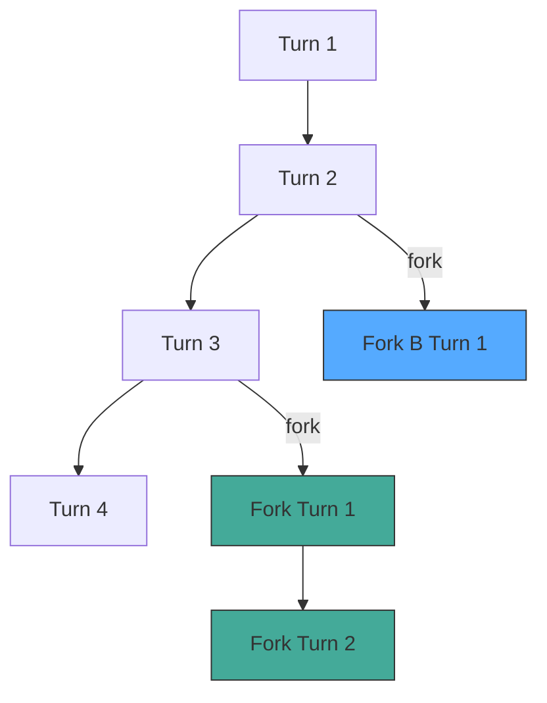

Future feature: treat conversations as trees instead of linear sessions.

## Context

Deferred from MVP4 (T-018). The idea is to evolve forking beyond simple nanoclaw parity into a full tree model:

- **Sub-sessions**: forked sessions hidden from sessions list, living under parent. `parent_session_id` column instead of `forked_from`.
- **Graph/tree view**: collapsible section in agent panel sidebar. Each node = one turn. Click node → scroll to turn. Fork branches visually distinct.
- **Chop-off / promote**: extract a subtree into its own first-class root session. Essential for keeping trees manageable as they grow.
- **Turn-level navigation**: clicking any node (including fork branches) switches chat view to that point in the conversation.

## Architecture Notes (from T-018 research)

DB would need `parent_session_id` (replaces simple `forked_from`), and sessions list would filter to roots only.

## Acceptance

- [ ] Tree data structure for sessions with forks
- [ ] Graph/tree UI component in sidebar
- [ ] Click node → navigate to turn
- [ ] Promote subtree to root session
- [ ] Sessions list shows only root sessions

## Notes

<!-- Agents and humans append timestamped notes here -->
