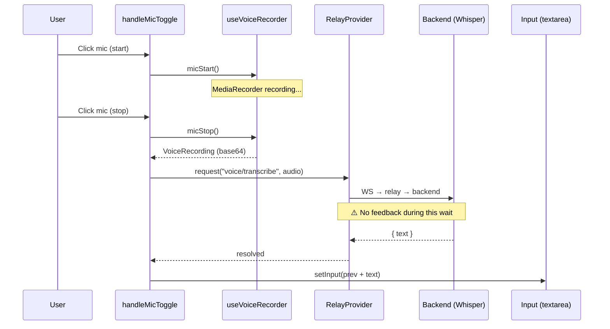

Multiple voice transcription issues:

1. **No loading feedback** — after clicking stop, zero visual feedback while Whisper transcribes (1-2s gap feels broken).
2. **Voice annotation may silently fail** — tried a voice annotation and it didn't get added. The annotation flow goes through `AnnotationLayer.tsx` → `commitVoice()` → `addAnnotation()`, separate from chat input. Popover/context may be lost before transcription returns.
3. **Possible failure when input already has text** — observed that a follow-up voice transcription didn't insert when the input box already contained transcribed text from a previous voice input. Not confirmed as root cause, but that was the context when it failed.

## Context

The flow is: mic stop → async `voice/transcribe` request → Whisper processes → `setInput(prev + text)`. The gap between stop and text appearing has zero feedback.

### Key files
- `frontend/src/modules/agents/AgentsPanel.tsx` — `handleMicToggle`, `setInput` call (~line 230)
- `frontend/src/core/useVoiceRecorder.ts` — recording hook
- `frontend/src/core/AnnotationLayer.tsx` — `commitVoice()`, voice annotation flow
- `backend/src/core/transcription.ts` — Whisper handler

## Acceptance

- [x] Show loading/transcribing indicator in or near the input box after mic stop
- [x] Indicator disappears once text is inserted
- [x] Voice annotation reliably adds annotation chip after transcription
- [x] Follow-up voice transcription works when input already contains text
- [x] Input still usable (not blocked) during transcription

## Notes
<!-- 2026-04-24 --> Observed: voice annotation didn't register. Also, follow-up mic transcription failed when input already had text from a prior transcription — context, not confirmed cause.
