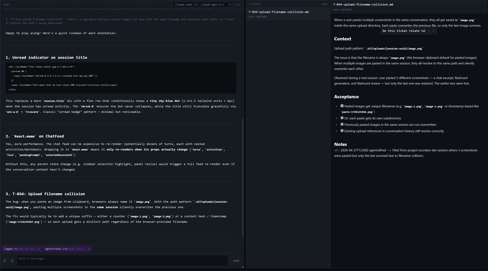
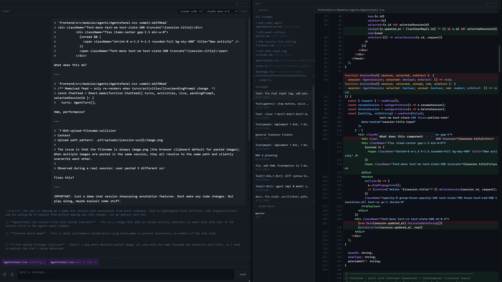
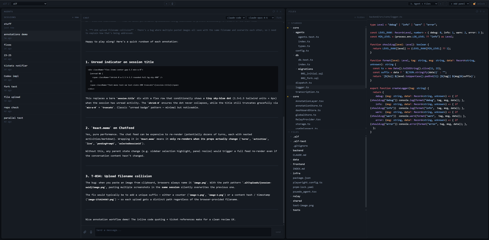
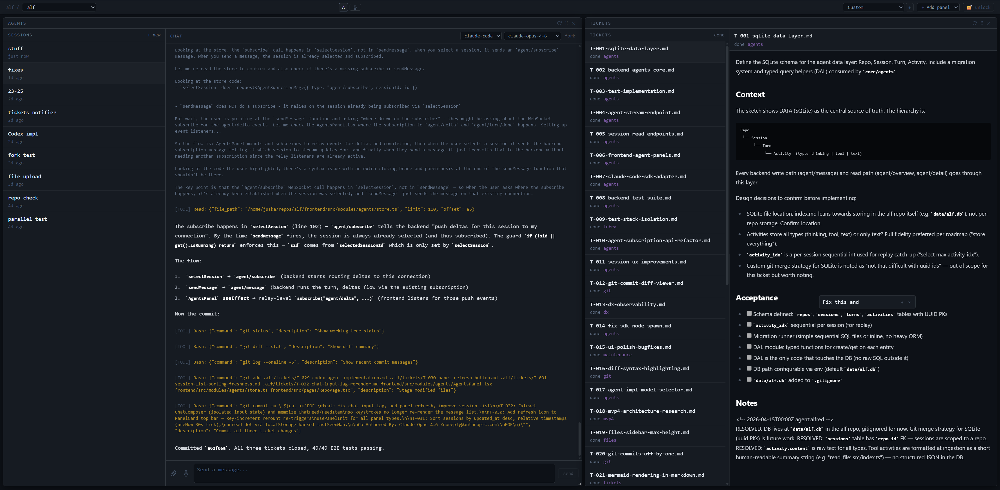

# Alf

A developer workspace for human-AI software engineering.

## What is this

I've been using AI coding tools (Claude Code, Cursor) heavily for side projects. They're great for velocity, but I kept running into the same problems:

- **Code drift.** Without active oversight, AI-generated code piles up and becomes a black box. It works, but the developer can't maintain it because they didn't really write it and they don't fully understand it.
- **Annotating code is clunky.** You see something in a file or a diff and want to tell the agent "fix this, here". There's no good way to select text, attach context (file path, line numbers), and pipe that into a conversation.
- **Task management doesn't exist.** "I want this feature but not right now" has no home. You forget it, or the AI doesn't know about it. Backlog items just vanish.
- **Too many windows.** Terminal, editor, browser, issue tracker. Context gets lost every time you switch.

Alf is my attempt at solving these. It's a browser-based workspace with a panel dashboard where everything (files, tickets, git history, agent chat) lives side by side and talks to the same backend over WebSocket.

The project itself is built with AI assistance, so it's both the tool and a live test of the workflow.

## Features

### Annotations

The core interaction. Select any text in any panel (a line of code, a git diff, a ticket), then type or speak a note about it. The selection context (file path, line numbers, commit SHA) gets automatically captured and attached to the current chat session. See something, say something, the agent acts on it with full context.


*Annotations with source context (file paths, line numbers) formatted into the agent conversation. Pending annotations show up as badges on the chat input.*

### Tickets

Markdown files with YAML frontmatter, stored in the repo's `.alf/tickets/` directory. Git-tracked, greppable, visible to both humans and AI agents. Status goes `open → in-progress → done → future`. The "future" status is the whole point: ideas get captured and stay retrievable instead of disappearing.

### Agent sessions

Chat sessions backed by the Claude Code Agent SDK with streaming responses. Sessions support forking (branch a conversation to explore a tangent without polluting the main context), multiple backends (a deterministic test agent for dev, Claude Code for production), and persistent history in SQLite.

### Git panel

Recent commits, syntax-highlighted diffs, and you can annotate directly from the git history. Useful for code review and for pointing the AI at specific changes.


*Agent conversation next to a syntax-highlighted diff. Select code changes and annotate them straight into the chat.*

### File browser

Tree view with syntax-highlighted content viewer, starred files for quick access. Like every other panel, it's designed to feed context into agent conversations.


*File tree (center), code viewer (right), agent session (left).*

### Dashboard

Drag-and-drop panel layout with saveable presets per repo. Want a focused agent view? A git review layout? A ticket triage board? Save each as a preset and switch between them.


*Agent session with streaming responses (left), ticket list and detail view (right).*

## Architecture

```
┌─────────────────────────────────────────────────────────┐
│  Frontend  (React 19, Zustand, Tailwind, Vite)          │
│  Panels: Agents | Files | Git | Tickets                 │
│  Core: RelayProvider, annotation, voice, dashboard       │
└────────────────────────┬────────────────────────────────┘
                         │ WebSocket
                    ┌────┴────┐
                    │  Relay  │  (Hono WS router, token auth)
                    └────┬────┘
                         │ WebSocket
┌────────────────────────┴────────────────────────────────┐
│  Backend  (Node.js, TypeScript, SQLite)                  │
│  Core: dispatch (@handle decorator), DB DAL, logger      │
│  Modules: agents, files, git, tickets, repos             │
│  Agent Impls: claude-code (SDK), test (deterministic)    │
└─────────────────────────────────────────────────────────┘
```

The relay sits between frontend and backend so the backend doesn't expose ports to the internet. All communication is bidirectional WebSocket, authenticated by a shared token. This also enables server-push for live streaming of agent responses.

### The 90/10 core

A deliberate design choice. The `core/` layer is small (maybe 10% of the codebase) but 90% of the execution flow goes through it. The idea is that as a developer you should know the core by heart. Everything else lives in self-contained modules (agents, files, git, tickets) with clear boundaries.

This came directly from dealing with the code drift problem. Keep the core clean and small, push feature complexity to the edges, and the codebase stays navigable even when AI agents write large chunks of module code.

## Tech stack

| Layer | Stack |
|-------|-------|
| Frontend | React 19, TypeScript, Zustand, Tailwind CSS, Vite |
| Backend | Node.js, TypeScript, SQLite (better-sqlite3) |
| Relay | Hono (lightweight HTTP/WS framework) |
| Agents | Anthropic Claude Code Agent SDK |
| Testing | Playwright (26 E2E tests across all modules) |
| Infra | systemd user services, three stacks (dev/test/prod) |

## Running locally

```bash
pnpm install
bash infra/scripts/install-dev.sh
systemctl --user start alf-dev.target
# Frontend at http://localhost:5000
```

Requires Node.js 20+, pnpm, and Linux with systemd (developed on WSL2).
